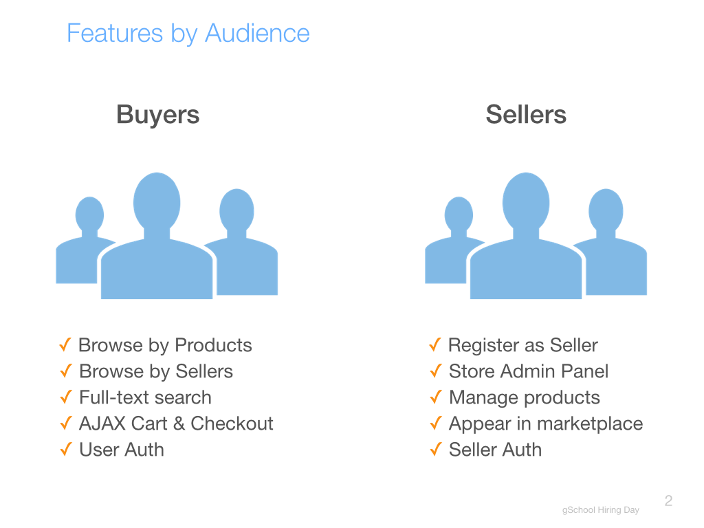

# README

# Deployment

 http://getfit-env.qrgxuspjgz.ap-southeast-2.elasticbeanstalk.com/products

### About the site

Getfit is Esty style peer-to-peer ecommerce site where buyer discover activities trackers produced by various manufacturers in a single place. I also gives vendors to showcase and sell their product and compete each other. 

## Features by audience.

#Users

	- Have can register as a seller and start selling.
	- Users have ability to browse products as a guest. Registration and sign in is not required unless they want to buy a product.
	- Users can see what is trending at the moment.
	- Products can be viewed according to their catagories. 
	- Users can go to the specific vendors, see their details and browse all the products offered by that manufacturer. 
	- When users click on the product they like it takes to that product page where larger image and more details of that product is presented. User can add the product he/she wants to buy to shopping cart. User will be asked to sign in at this point if he/she haven't sign in. 
	- More of same items can be added to the cart and cart automatically calculates the total balance.

#Sellers

	- Any vendors can be seller by simply clicking on 'Become a seller' link and create their own profile.
	- Vendors can upload their logo, banner and their detailed information. 
	- They have their own dashboard dedicated to them from where they can add, delete, edit their products and upload product image.
	- Vendors having wide range of catalouges can import CSV file and can do bulk upload. It gives the flexibility to review and edit the information before uploading and also saves lots of time. 
	- Vendors can also edit and delete their profile.
  

#Further Development
  - Stripe integration
  - User feedback and rating for the product they buy.
  - Messaging
  - Search functionality and view by category
  - Notification.
  - Admin dashboard (Got vendor admin dashboard)
  
#Documentation (Application Summary, Personas, User Stories, ERDs and Wireframes)
	- https://1drv.ms/f/s!AjdhMg80TT-TpW2DnHBhjIyC_xjS
